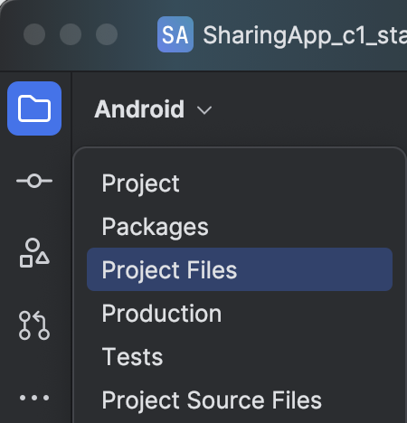

# ualberta_ood_sharingapp
App from course provided by University of Alberta on Coursera called [Object-Oriented Design](https://www.coursera.org/learn/object-oriented-design)

## Disclaimer
Please note that I am not the original creator or developer of this application. The app was developed by a third party, and my involvement was limited to providing a solution for fixing a specific issue within the app. I am not responsible for the app's overall functionality, content, or any potential issues that may arise from its use. For any concerns or inquiries related to the app's design, features, or performance, please contact the original developer or refer to the official support channels provided by the app's creators.

## Steps to resolve upgrading problem:
1. Firstly load project into android studio
2. Open project
3. Wait for sync to fail
4. Switch from project to project files 

5. Open ```gradle/wrapper/gradle-wrapper.properties``` and change gradle version to ```8.5```
6. Open ```build.gradle``` in root and change only dependency to version ```8.1.1```. During this you'll be asked to allow editing until IDE restart. Select Any non-project file, click OK
7. Synchronize the project
8. Error will pop up ```Namespace not specified. Specify a namespace in the module's build file. See https://d.android.com/r/tools/upgrade-assistant/set-namespace for information about setting the namespace. If you've specified the package attribute in the source AndroidManifest.xml, you can use the AGP Upgrade Assistant to migrate to the namespace value in the build file. Refer to https://d.android.com/r/tools/upgrade-assistant/agp-upgrade-assistant for general information about using the AGP Upgrade Assistant." ```

9. head to root ```settings.gradle``` and change ```include ':app'``` to ```include 'com.example.sharingapp'```.
10. sync project.
11. do step 9. but reversibly (head to root ```settings.gradle``` and change ```include 'com.example.sharingapp'``` to ```include ':app'```.)
12. sync project
13. run the app. App won't compile because of two missing classes that you need to create and implement accordingly to the assignment. 

### note:
When you'll implement missing classes you'll encounter an error in class ``` MainActivity.java ```, in method ``` onOptionsItemSelected(MenuItem item) ```. I replaced the content of the switch with this:
``` 
if (item.getItemId() == R.id.contacts) {
    Intent intent = new Intent(this, ContactsActivity.class);
    startActivity(intent);
    return true;
}
return super.onOptionsItemSelected(item);
```